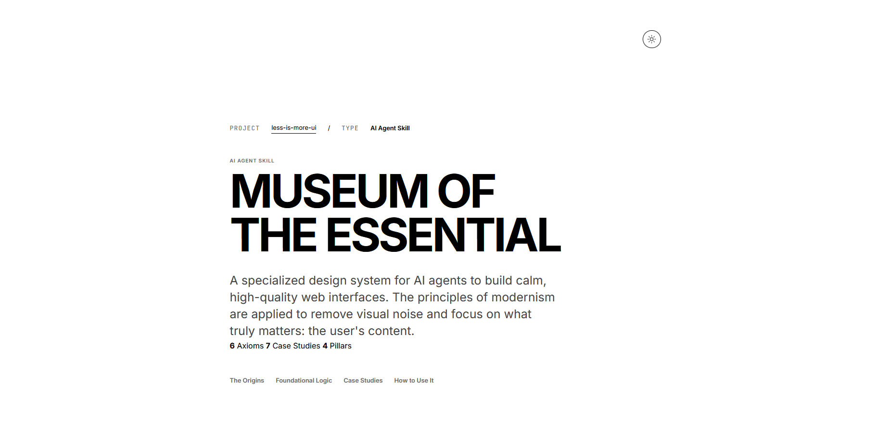

# Less Is More UI

> "Good design is as little design as possible." — Dieter Rams

<p>
  <a href="https://www.npmjs.com/package/@mendiak/less-is-more-ui"></a>
  <a href="LICENSE"></a>
</p>

A specialized design skill for AI agents to generate calm, high-quality, and functional web interfaces.



## The Problem
Most AI-generated UIs suffer from "visual noise": excessive shadows, generic gradients, and cluttered layouts. They often lack a clear typographic hierarchy and rational structure because LLMs tend to default to "over-designed" or generic components.

## The Solution
`less-is-more-ui` provides a set of modernist constraints that force the agent to prioritize content and function. It transforms the agent from a generic coder into a senior designer with a Miesian perspective, focusing on:

- **Rational Layouts:** Using grid systems and generous whitespace instead of decorative containers.
- **Typography-First Hierarchy:** Letting text carry the weight of the interface.
- **Subtle Palettes:** Using color to support, not dominate.
- **Systematic Spacing:** A predefined variable-based scale for consistent rhythm.

## Installation

### As an AI Agent Skill

```bash
npx skills add Mendiak/less-is-more-ui
```

### As a CSS Design System (npm)

Installs design tokens, a minimalist reset, and reusable component patterns.

```bash
npm install @mendiak/less-is-more-ui
```

Then in your project's CSS:

```css
/* Import everything (tokens + reset + components) */
@import "@mendiak/less-is-more-ui";

/* Or import only what you need */
@import "@mendiak/less-is-more-ui/references/tokens.css";
@import "@mendiak/less-is-more-ui/assets/css/reset.css";
@import "@mendiak/less-is-more-ui/assets/css/components.css";
```

**What's included:**

| File | Description |
|------|-------------|
| `tokens.css` | CSS custom properties: modular typographic scale, spacing system, neutral palette, semantic aliases (`var(--ui-bg)`, `var(--ui-text)`, etc.), and dark/light theme support |
| `reset.css` | Minimalist box-sizing reset and base element normalization |
| `components.css` | Reusable UI patterns: `.button`, `.input`, `.essential-card`, `.essential-nav`, `.essential-filters`, `.essential-specs`, `.essential-form`, `.icon`, and utility classes |
| `style.css` | *(Demo only)* Styles for the [Museum of the Essential](https://mendiak.github.io/less-is-more-ui/) showcase page. Not intended for external projects. |

## How to Use with AI Agents

Once activated, you can direct your agent with high-level design intent. The agent will use the bundled resources (`principles.md`, `references/components.md`, etc.) to make informed decisions.

**Example Prompts:**
- *"Refactor this dashboard following the Less Is More manifesto."*
- *"Simplify this landing page. Use only the scale variables and remove all decorative elements."*
- *"Build a contact form using the 'Honest Materials' precept (semantic HTML only)."*

## Demo
Visit the [Museum of the Essential](https://mendiak.github.io/less-is-more-ui/) for a curated showcase of these principles in action.

## Repository Structure

- `SKILL.md` – Main entry point and agent instructions.
- `docs/principles.md` – Core design philosophy (Mies, Sullivan, Rams).
- `docs/design-manifesto.md` – High-level goals and aesthetic standards.
- `docs/design-process.md` – Step-by-step method for minimal interface design.
- `docs/animations.md` – Functional standards for subtle micro-interactions.
- `docs/responsive.md` – Strategies for mobile-first reduction.
- `docs/accessibility.md` – Minimalist standards for inclusive design.
- `docs/typography.md` – Typographic pairing and technical standards.
- `docs/anti-patterns.md` – Visual friction to identify and remove.
- `docs/design-checklist.md` – Final UI quality verification.
- `assets/css/style.css` – Demo showcase styles for the Museum of the Essential.
- `assets/css/components.css` – Reusable UI component patterns (buttons, forms, cards, navs).
- `index.html` – The "Museum of the Essential" documentation and demo.
- `references/`
  - `axioms.md` – Foundational truths of minimal design.
  - `case-studies.md` – Analysis of successful minimal interfaces.
  - `components.md` – Pattern library for buttons, inputs, and cards.
  - `tokens.css` – Design tokens and scale variables.
- `evals/` – Performance benchmarks and evaluation sets.
- `assets/css/reset.css` – Tiny modernist reset for a clean start.
- `index.css` – Entry point for the npm package.
- `package.json` – npm package configuration.

## Philosophy

1. **Less is more.** (Reduction to the essential)
2. **Form follows function.** (Logic over decoration)
3. **Less but better.** (Instinctive simplicity)

---

Developed for clarity and purpose by [Mendiak](https://github.com/Mendiak).
